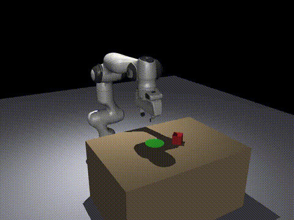

# Physical AI Pick-and-Place Policy

This repository contains a compact reproduction package for a MuJoCo Franka pick-and-place imitation-learning policy.

The submitted policy is a hybrid controller:

- an MLP action head predicts 7 joint deltas plus one gripper command;
- a GRU transition head predicts when to advance to the next geometric waypoint;
- the inference API remains compatible with the original `student_policy.py` submission interface.

## Demo

The included checkpoint succeeds on `sample_env/21.npz`:

[](assets/demo_success_21.mp4)

Click the preview to open the MP4: [`assets/demo_success_21.mp4`](assets/demo_success_21.mp4).

## Included Files

| Path | Purpose |
|---|---|
| `student_policy.py` | Self-contained submission policy used for evaluation. |
| `rnn_transition_random800_dagger80_best.pth` | Best checkpoint. |
| `rnn_transition_random800_dagger80_stats.npz` | Normalization statistics for the checkpoint. |
| `evaluate_policy.py` | Script version of the submission tester. |
| `render_policy_episode.py` | Renders one rollout to MP4. |
| `random_env_generator.py` | Generates randomized env-only `.npz` files. |
| `random_trajectory_generator.py` | Generates full expert trajectories. |
| `collect_dagger_failures.py` | Collects failed rollout states with expert labels for DAgger-style training. |
| `rnn_transition_trainer.py` | Trainer for the GRU transition + MLP action policy. |
| `student_trainer.py` | Action-model utilities reused by the RNN trainer. |
| `sample_env/` | Small public environment subset for quick local tests. |
| `EXPERIMENT_RESULTS.md` | Experiment log and performance table. |

Large generated datasets are intentionally not included. Recreate them with the commands below.

## Setup

Create and activate a Python environment, then install dependencies:

```bash
pip install -r requirements.txt
pip install imageio-ffmpeg
```

On a headless Linux machine, MuJoCo rendering may also need:

```bash
export MUJOCO_GL=egl
export PYOPENGL_PLATFORM=egl
```

## Quick Evaluation

Evaluate the included policy on the sample environments:

```bash
python evaluate_policy.py \
  --policy_file student_policy.py \
  --checkpoint_file rnn_transition_random800_dagger80_best.pth \
  --stats_file rnn_transition_random800_dagger80_stats.npz \
  --env_dir sample_env \
  --output_json sample_eval.json
```

`sample_env/` is a tiny smoke-test subset, not a full benchmark. Use freshly generated or held-out environments for meaningful generalization measurements.

Render the demo rollout:

```bash
python render_policy_episode.py \
  --policy_file student_policy.py \
  --checkpoint_file rnn_transition_random800_dagger80_best.pth \
  --stats_file rnn_transition_random800_dagger80_stats.npz \
  --env_path sample_env/21.npz \
  --output_video assets/demo_success_21.mp4 \
  --output_json assets/demo_success_21.json \
  --fps 30
```

The success criterion follows the tester code:

```text
success if final_block_target_distance < 0.05 + block_size
```

## Generate Data

Generate randomized env-only test scenes:

```bash
python random_env_generator.py \
  --output_dir random_envs_100 \
  --num_envs 100 \
  --seed 500000
```

Generate full expert trajectories for behavior cloning:

```bash
python random_trajectory_generator.py \
  --output_dir random_trajectories_1000 \
  --num_trajectories 1000 \
  --seed 200000 \
  --max_attempts 3000 \
  --summary_every 50
```

The generator keeps table XY size fixed by default and randomizes table height, block size, block yaw, block position, and target position. You can inspect the available ranges with:

```bash
python random_trajectory_generator.py --help
python random_env_generator.py --help
```

## Reproduce the Main Training Recipe

The best included checkpoint was trained from:

- original public train trajectories;
- 800 randomized expert trajectories;
- 50 DAgger failures from the public evaluation environments;
- 30 DAgger failures from randomized train environments.

A representative command is:

```bash
python rnn_transition_trainer.py \
  --train_glob "train/*.npz" \
  --extra_train_glob "random_trajectories_1000/*.npz" \
  --train_list splits/random_1000_20260616_train800.txt \
  --valid_glob "valid/*.npz" \
  --extra_valid_glob "random_trajectories_1000/*.npz" \
  --valid_list splits/random_1000_20260616_valid100.txt \
  --dagger_glob "dagger_failures/**/*.npz" \
  --max_epoch 10 \
  --num_workers 0 \
  --save_dir . \
  --stats_name rnn_transition_stats.npz \
  --best_ckpt_name rnn_transition_best.pth \
  --last_ckpt_name rnn_transition_last.pth
```

Use `--num_workers 0` on Windows if multiprocessing dataloading is unstable.

## DAgger-Style Failure Collection

Collect failed rollouts and save expert-labeled recovery trajectories:

```bash
python collect_dagger_failures.py \
  --policy_file student_policy.py \
  --checkpoint_file rnn_transition_random800_dagger80_best.pth \
  --stats_file rnn_transition_random800_dagger80_stats.npz \
  --env_dir random_envs_100 \
  --output_dir dagger_failures/random_envs_100 \
  --max_failures 30
```

The collected files can be added through `--dagger_glob` during another training run.

## Current Best Checkpoint

Use these files for submission-compatible evaluation:

```python
POLICY_FILE = "./student_policy.py"
CHECKPOINT_FILE = "./rnn_transition_random800_dagger80_best.pth"
STATS_FILE = "./rnn_transition_random800_dagger80_stats.npz"
```

The policy file is self-contained and does not import `rnn_transition_policy.py` or `waypoint.py` at evaluation time.
